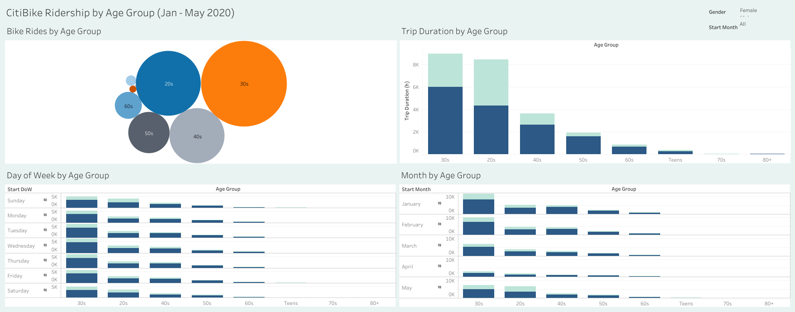
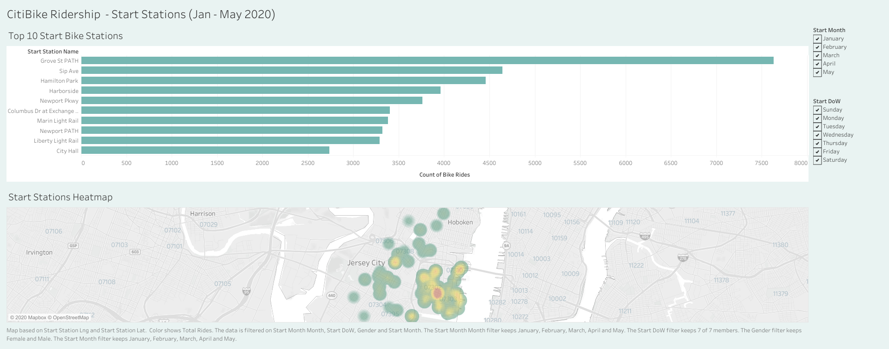

# Citi Bike Analytics

* Age Group Dashboard
https://public.tableau.com/views/AgeGroupCitiBikeDashboardJan-May2020/AgeGroupDashboard?:language=en&:retry=yes&:display_count=y&:origin=viz_share_link
* Start Station Dashboard (includes map)
https://public.tableau.com/views/BikeStationsCitiBikeDashboardJan-May2020/StationsDashboard?:language=en&:display_count=y&publish=yes&:origin=viz_share_link
* CitiBike Story (includes brief analysis)
https://public.tableau.com/profile/gina.cameras#!/vizhome/Citibike2020AnalysisJan-May2020/CitiBikeStory

## Analysis

Age Group: 
 * Riders in the 30s range are the most prevalent followed by the 20s group.
 * The 30s group shows the longest trip duration, are the heaviest users all days of the week and all months in 2020. 
 * Ridership among 30s group has fallen durining COVID as commuters are now working from home, but picking back up in May.
 
 

Start Stations:
 * The busiest bike station is the Grove St PATH location. 
 * It's one the busiest as it's close to a PATH train station. 
 * The heatmap reflects the Grove station zipcode (07302) in red as the busiest start location.

 
